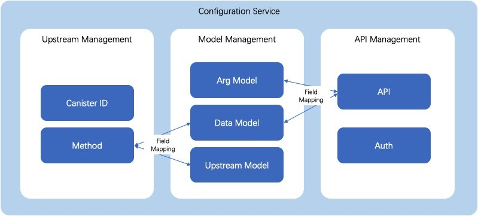
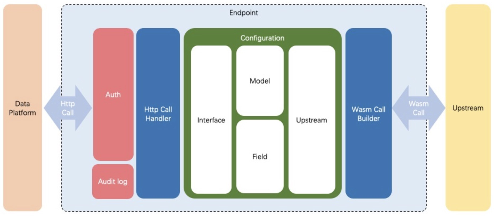

# IC-Data-Platform

The data transformation platform is an open source project that facilitates convenient communication between Web2 and IC ecosystem. It provides an unified and standard data docking method for third-party users through the data platform, which simplifies the interaction cost between IC and Web2 to a certain extent and reduces the development workload.

## 1. Configuration

    Configuration Service includes Upstream Management, Model Management, and API Management.
    
    Upstream means canisters here. Upstream Management maintains principal and methods of the data providing canisters.
    
    API Management maintains HTTP interfaces which provide external services.
    
    Model Management includes Argument Model, Data Model and Upstream Model.
      Argument Model maintains arguments in API interface.
      Upstream Model maintains input parameters of canister methods. 
      Data Model maintains the data structure which get from canisters and will be returned to the API interface.
      
    Field Mapping
      Argument Model need to be converted into Upstream Model by field mapping, to make sure that correct input parameters can be passed into the Upstream Management.
      Output data from Upstream Management should be converted into Data Model by field mapping, to make sure that correct output values can be returned to API Management.



## 2. Endpoint

    When an HTTP request enters the endpoint canister:
    
    First it goes through the auth module to check the access privilege and save the audit log.
    
    Then parses the request path to the upstream interface, and converts the request parameters into input parameters of the upstream interface, and make an WASM call.
    
    After obtaining the return value of the upstream interface, the return value will be parsed into a particular data model by configuration, and return to the caller.




Demonstration of how to define the workflow of the data transformation platform
```
https://a4gq6-oaaaa-aaaab-qaa4q-cai.raw.icp0.io/?id=i7hvj-riaaa-aaaag-qcuya-cai
```

## 3. Function

### "create_function_mapping" : (FunctionMapping) -> (bool);
    Create a function mapping to map the function definition based on the IC to the open Http protocol endpoint, so as to provide a common request mode for third-party users.

### "query_function_mapping" : () -> (vec FunctionMapping) query;
    Query existing function mappings.

### "query_function" : (text) -> (vec Function) query;
    Query function definition based on function name.

## 4. Entity

### Entity
    
```
pub struct Entity {
    pub name: String,
    pub code: String,
    pub entity_type: String,
    pub fields: Vec<Entity>,
    pub is_opt: bool,
}
```

    Entity class
      name : Entity name
      code : Entity code
      entity_type : Entity type -> bool,number,string,principal,enum,array,object,tuple
      fields : Field list
      is_opt : If the parameters are required.

### EntityMapping
```
pub struct EntityMapping {
    pub source: Entity,
    pub target: Entity,
}
```
    Mapping relationship between source entity and target entity
      source : Source entity
      target : Target entity
    
### Funciton
```
pub struct Function {
    pub func_name: String,
    pub func_type: String, //request,forward
    pub canister_id: Option<Principal>,
    pub request_entities: Vec<Entity>,
    pub response_entities: Vec<Entity>,
}
```
    Function class
      func_name : Function name.
      func_type : Function type: request/forward.
      canister_id : Canister id, required for forward type functions.
      request_entities : Request parameters, a set of Entity instance data.
      response_entities : Response result, a set of Entity instance data.

### FunctionMapping
```
pub struct FunctionMapping {
    pub request_func: Function,
    pub forward_func: Function,
    pub request_mapping: EntityMapping,
    pub response_mapping: EntityMapping,
}
```
    Function mapping class
      request_func : Definition of endpoint parameters for user access from the Web2 world, including data such as name, request parameters, response results, etc.
      forward_func : Forwarded to canister endpoints implemented based on IC network, including endpoint name, canister id, request parameters, response results, etc.
      request_mapping : Request parameter relation mapping, mapping request parameters in request_func to request parameters in forward_func, so that parameter field names and data structures can be transformed in the actual endpoint request process.
      response_mapping : Mapping the response result relation between the response result in request_func and the response result in forward_func, so that the field name and data structure of the response result can be transformed during the actual endpoint request.

## 5. How to get the data of the target endpoint through the Http request

### When request parameters are not required
Get or Post request

Example: 

    url: https://i7hvj-riaaa-aaaag-qcuya-cai.raw.icp0.io/query_pools_vol
		
### When request parameters are required
Post request, Content-Type=application/json

Example: 

    url: https://i7hvj-riaaa-aaaag-qcuya-cai.raw.icp0.io/query_pool_last_tvl
	request_body: {"poolId": "sphr2-eaaaa-aaaag-qcrqa-cai"}

### When using the command line

Example: 

	curl -X POST -H "Content-type:application/json" -d '{"poolId":"sphr2-eaaaa-aaaag-qcrqa-cai"}' https://i7hvj-riaaa-aaaag-qcuya-cai.raw.icp0.io/query_pool_last_tvl
